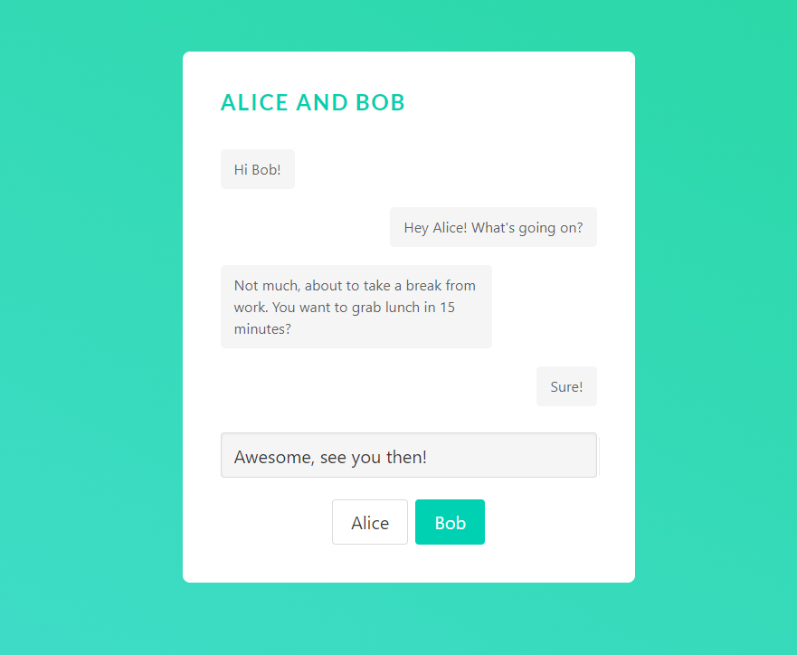

# Chat creator

A single page webapp to generate mock chats. Useful for designing chats for polyglots that want to learn multiple spoken languages. 

## Technologies used
- Angular
- Express
- MongoDB   
- Bulma CSS Framework
- SASS

## Running
Don't forget to run the api server and angular server to view and develop.

## Work in Progress
- (Completed) Appending textarea for the text that will be appended
- (Completed) Adding a second button to be able to distinguish which person in the chat to assign the text to
- (Completed) Add field to mongoose model to differentiate between alice and bob (messages floating to left or floating to right)
- (Completed) Create component function to add messages from input/textarea to database
- Use directives to display the messages on the correct side when viewing (Alice messages on left, Bob messages on right)
- Split addMessage component function to 2 separate functions. One adds Alicess', other adds Bob's messages
